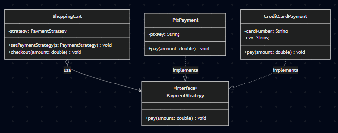

# 📚 Padrões de Projeto (Design Patterns)

Este repositório reúne exemplos práticos dos padrões de projeto **Strategy**, **Observer** e **Composite**, demonstrando também seus respectivos **anti-patterns**.

O objetivo é fornecer um guia de estudo claro, com comparações diretas, diagramas UML e implementações de código para facilitar a compreensão de quando (e como) aplicar cada solução.

---

## 1. Strategy

### Conceito
O **Strategy** permite definir uma família de algoritmos, colocar cada um deles em uma classe separada e fazer com que seus objetos sejam intercambiáveis. O algoritmo pode variar independentemente dos clientes que o utilizam.

### UML
#### Pattern

#### Anti-pattern
[Strategy Anti-pattern UML](./strategy/antipattern/uml-strategy-antipattern.png)

---

## 2. Observer

### Conceito
O **Observer** estabelece um mecanismo de assinatura para notificar múltiplos objetos sobre quaisquer eventos que aconteçam com o objeto que eles estão observando.

### UML
#### Pattern

#### Anti-pattern

---

## 3. Composite

### Conceito
O **Composite** permite compor objetos em estruturas de árvore e trabalhar com essa estrutura como se fosse um objeto individual. É ideal para representar hierarquias.

### UML
#### Pattern

#### Anti-pattern

---

## 📊 Resumo Comparativo

Abaixo, uma visão geral dos padrões abordados, seus propósitos e como eles se diferenciam de uma implementação ingênua (anti-pattern).

| Padrão | O que resolve (Problema) | Solução Proposta (O Padrão) | Diferença para o Anti-pattern | Exemplo Prático |
| :--- | :--- | :--- | :--- | :--- |
| **Strategy** | Algoritmos condicionais complexos e herança rígida. | Isola famílias de algoritmos em classes separadas, tornando-os intercambiáveis. | **Padrão:** Flexibilidade para trocar lógica em tempo de execução. **Anti-pattern:** Lógica "hardcoded" no cliente (muitos `if/else`). | App de GPS que traça rotas diferentes (carro, a pé, transporte público) dependendo da escolha do usuário. |
| **Observer** | Alto acoplamento ao tentar manter objetos sincronizados. | Cria uma assinatura "um-para-muitos": quando o sujeito muda, os observadores são avisados. | **Padrão:** Desacoplamento; o sujeito não conhece os detalhes dos observadores. **Anti-pattern:** Objetos chamando métodos uns dos outros diretamente. | Células de uma planilha: ao alterar um valor, gráficos e fórmulas dependentes se atualizam automaticamente. |
| **Composite** | Dificuldade em tratar objetos simples e grupos de objetos da mesma forma. | Utiliza uma estrutura de árvore para representar hierarquias "parte-todo" uniformemente. | **Padrão:** Cliente trata folhas e nós compostos igualmente. **Anti-pattern:** Verificações de tipo constantes e código duplicado. | Elementos de interface gráfica: uma Janela contém Painéis, que por sua vez contêm Botões e Caixas de Texto. |
